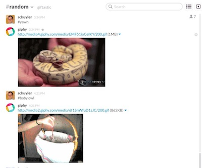

# Gifbot

Gifbot is a lightweight Sinatra app that provides [Slack](http://slack.com/) with embedded keyword search for animated GIFs, using the [Giphy](http://giphy.com/) API, and Slack's webhooks integration. Once setup, you can type `#puppies` in your Slack channel, and Gifbot will post a random animated GIF of adorable puppies to the channel.

## Seriously?

Yes.

## Why?

What better way to celebrate a teammate's _bon mot_, or to herald a successful code deployment, or announce your imminent departure for lunch?

## How?

* Download Gifbot and run `bundle install --path .gems` in the `gifbot` directory. You may need to `sudo gem install bundler` first.

* Set up an outgoing webhook migration in Slack using `http://host:port/gif` as the URL, substituting the host and port that you'll be running the server on. (Unless you tell it otherwise, Sinatra runs on port 4567 by default.) You may opt to configure `#` as the default trigger word for the webhook.

* Slack will give you an application token for this integration; note it. 

* Edit `gifbot.rb` and set your `SLACK_TOKEN`. You _must_ do this or Gifbot will ignore all attempts to communicate.

* Optionally, set `GIPHY_KEY` to your Giphy key, if you have one. The provided key is Giphy's public beta token and works out of the box, but they like you to [contact them](https://github.com/giphy/GiphyAPI) and ask for a real key if you're using Giphy for serious. You can also change the trigger word and the image style.

* Run `./start_gifbot.sh` on a public webserver, in a screen(1) session or something. 

* Type `#kittens` into your Slack chat and voilà.

## Are you kidding?

This software took me 20 minutes to write and is released into the public domain. If it breaks, you get to keep _all_ the pieces. Patches welcome, and hugs for everyone.

SDE

__=30=__
